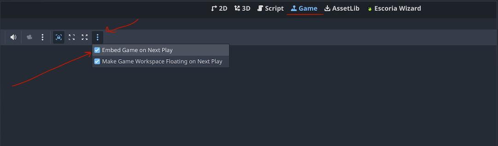

# Room Nr 1

## Stack

[Godot 4.*](https://godotengine.org/)  
[Escoria - Godot Addon for point and click games](https://github.com/godot-escoria)

## Tutorials and Examples

[Escoria Demo - Github](https://github.com/godot-escoria/escoria-demo-game)  
[Escoria Video Tutorial - 2023](https://www.youtube.com/watch?v=BxrZbE0TzAM&t=402s)
[Escoria Doc - Step by Step](https://docs.escoria-framework.org/en/devel/getting_started/step_by_step/index.html)

## Cursor specific  

When working on mac curor will NOT refresh when in embeded mode. In is known [bug](https://github.com/godotengine/godot/issues/110800) 
In order to use it correctly disable embeded mode. 

## Highlight of elements

[Shaders intro](https://www.youtube.com/watch?v=GCZT1_bd_7w)

## Comments and other wierd stuff

When defining start script it was not reading init. 
I copy it from simple project. I restarted GODOT. It worked...

To get plugin to work. Copied from example project. Restart GODOT. 

In order to menu to work klick to "play" but "movie play"

## Escoria tips

Esc script needs to consists real TAB signs, not just spaces.

ESCInteractionLocation is needed for interaction to work. Player needs to know where to move to start interaction.
It might be not needed when TK (telekinesis) option is used. ex. :pickup | TK

In order to use item with something you need to set "Combine when selected action is in" on ESCItem.
